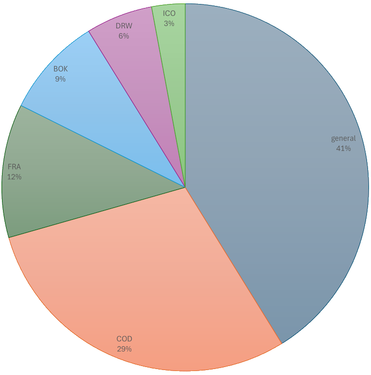

# Cadmus NDP API

- [Cadmus NDP API](#cadmus-ndp-api)
  - [Facets](#facets)
    - [Parts Matrix](#parts-matrix)
  - [Authorithies](#authorithies)

🐋 Quick Docker image build:

```sh
docker buildx create --use

docker buildx build . --platform linux/amd64,linux/arm64,windows/amd64 -t vedph2020/cadmus-ndp-api:2.0.6 -t vedph2020/cadmus-ndp-api:latest --push
```

(replace with the current version).

This is a Cadmus API layer customized for Cadmus NDP (Naples Dante Project). Most of its code is derived from [shared Cadmus libraries](https://github.com/vedph/cadmus-api).

- [Cadmus NDP Frac](https://github.com/vedph/cadmus-ndp-frac)
- [Cadmus NDP Books](https://github.com/vedph/cadmus-ndp-books)
- [Cadmus NDP Drawings](https://github.com/vedph/cadmus-ndp-drawings)
- [Cadmus Iconography](https://github.com/vedph/cadmus-iconography)

## Facets

The list of facets is given here with their conventional groupings used in the editor UI. The 3-letters abbreviation after each part type name refers to Cadmus model spaces different from the generic one. Here we have `COD`=codicology, `FRA`=fragments, `BOK`=books, `DRW`=drawings, `ICO`=iconography. Also, 🔗 means a potential _internal_ link; where there is a links part without this indication, the usual implication is that it contains _external_ links.

> All items have a metadata part where the metadatum named `eid` can be used to provide a human-friendly identifier for the item as a whole, to be used when looking up items in internal linking. This is an opt-in mechanism: like in TEI you add an `xml:id` attribute to those elements you want to reference from another part of the document, here you add an `eid` to those items you want to link from another item's part.

- **manuscript**

  - _identity_
    - [metadata](https://github.com/vedph/cadmus-general/blob/master/docs/metadata.md)
    - [shelfmarks](https://github.com/vedph/cadmus-codicology/blob/master/docs/cod-shelfmarks.md) (COD)
    - [links](https://github.com/vedph/cadmus-general/blob/master/docs/pin-links.md)
    - [categories](https://github.com/vedph/cadmus-general/blob/master/docs/categories.md):`txt` 🚩 (text categories are a cross-reference taxonomy used to define the text type (e.g. comment) from the philological point of view)
  - _history_
    - [chronotopes](https://github.com/vedph/cadmus-general/blob/master/docs/chronotopes.md)
    - [historical events](https://github.com/vedph/cadmus-general/blob/master/docs/historical-events.md):`ms` 🚩
    - [note](https://github.com/vedph/cadmus-general/blob/master/docs/note.md):`hist` (history) 🚩
  - _material_
    - [bindings](https://github.com/vedph/cadmus-codicology/blob/master/docs/cod-bindings.md) (COD)
    - [sheet labels](https://github.com/vedph/cadmus-codicology/blob/master/docs/cod-sheet-labels.md) (COD)
    - [material description](https://github.com/vedph/cadmus-codicology/blob/master/docs/cod-material-dsc.md) (COD)
    - [watermarks](https://github.com/vedph/cadmus-codicology/blob/master/docs/cod-watermarks.md) (COD)
    - [preservation states](https://github.com/vedph/cadmus-general/blob/master/docs/physical-states.md)
  - _content_
    - [contents](https://github.com/vedph/cadmus-codicology/blob/master/docs/cod-contents.md) (COD)
    - [layouts](https://github.com/vedph/cadmus-codicology/blob/master/docs/cod-layouts.md) (COD)
    - [decorations](https://github.com/vedph/cadmus-codicology/blob/master/docs/cod-decorations.md) (COD) 🔗 `iconography`, `person`
    - [iconography instructions](https://github.com/vedph/cadmus-iconography/blob/master/docs/ico-instructions.md) (ICO) 🔗 `iconography`
    - [hands](https://github.com/vedph/cadmus-codicology/blob/master/docs/cod-hands.md) (COD) 🔗 `person`
    - [edits](https://github.com/vedph/cadmus-codicology/blob/master/docs/cod-edits.md) (COD) 🔗 `person`
    - [notable word forms](https://github.com/vedph/cadmus-ndp/blob/master/docs/notable-word-forms.md) (NDP)
  - _editorial_
    - [note](https://github.com/vedph/cadmus-general/blob/master/docs/note.md)
  - _references_
    - [references](https://github.com/vedph/cadmus-general/blob/master/docs/doc-references.md) (mostly used for Zotero bibliography)

- **fragment**

  - _identity_
    - [metadata](https://github.com/vedph/cadmus-general/blob/master/docs/metadata.md)
    - [shelfmarks](https://github.com/vedph/cadmus-codicology/blob/master/docs/cod-shelfmarks.md) (COD)
    - [links](https://github.com/vedph/cadmus-general/blob/master/docs/pin-links.md) 🔗 `manuscript` (+group)
    - [categories](https://github.com/vedph/cadmus-general/blob/master/docs/categories.md):`txt` 🚩
  - _history_
    - [chronotopes](https://github.com/vedph/cadmus-general/blob/master/docs/chronotopes.md)
    - [historical events](https://github.com/vedph/cadmus-general/blob/master/docs/historical-events.md):`fr` 🚩
    - [note](https://github.com/vedph/cadmus-general/blob/master/docs/note.md):`hist` (history)
  - _material_
    - [support](https://github.com/vedph/cadmus-ndp-frac/blob/master/docs/cod-fr-support-part.md) (FRA)
    - [rulings](https://github.com/vedph/cadmus-ndp-frac/blob/master/docs/cod-fr-rulings-part.md) (FRA)
    - [labels](https://github.com/vedph/cadmus-ndp-frac/blob/master/docs/cod-fr-quire-labels-part.md):`sig` (FRA) 🚩
    - [labels](https://github.com/vedph/cadmus-ndp-frac/blob/master/docs/cod-fr-quire-labels-part.md) (FRA)
    - [decorated counts](https://github.com/vedph/cadmus-general/blob/master/docs/decorated-counts.md):`fr` 🚩
    - [measurements](https://github.com/vedph/cadmus-general/blob/master/docs/physical-measurements.md):`fr` 🚩
    - [preservation states](https://github.com/vedph/cadmus-general/blob/master/docs/physical-states.md)
  - _content_
    - [contents](https://github.com/vedph/cadmus-codicology/blob/master/docs/cod-contents.md) (COD)
    - [layout](https://github.com/vedph/cadmus-ndp-frac#codfrlayoutpart) (FRA)
    - [decorations](https://github.com/vedph/cadmus-codicology/blob/master/docs/cod-decorations.md) (COD) 🔗 `iconography`, `person`
    - [iconography instructions](https://github.com/vedph/cadmus-iconography/blob/master/docs/ico-instructions.md) (ICO) 🔗 `iconography`
    - [hands](https://github.com/vedph/cadmus-codicology/blob/master/docs/cod-hands.md) (COD) 🔗 `person`
    - [edits](https://github.com/vedph/cadmus-codicology/blob/master/docs/cod-edits.md) (COD) 🔗 `person`
    - [notable word forms](https://github.com/vedph/cadmus-ndp/blob/master/docs/notable-word-forms.md) (NDP)
  - _editorial_
    - [note](https://github.com/vedph/cadmus-general/blob/master/docs/note.md)
  - references
    - [references](https://github.com/vedph/cadmus-general/blob/master/docs/doc-references.md)

- **print edition**

  - _identity_
    - [metadata](https://github.com/vedph/cadmus-general/blob/master/docs/metadata.md)
    - [links](https://github.com/vedph/cadmus-general/blob/master/docs/pin-links.md) (this can include also authors and editors) 🔗 `person`
    - [categories](https://github.com/vedph/cadmus-general/blob/master/docs/categories.md):`txt` 🚩
  - _history_
    - [chronotopes](https://github.com/vedph/cadmus-general/blob/master/docs/chronotopes.md):`prn` 🚩 (print date/place)
    - [chronotopes](https://github.com/vedph/cadmus-general/blob/master/docs/chronotopes.md):`pub` 🚩 (publication date/place)
  - _content_
    - [fonts](https://github.com/vedph/cadmus-ndp-books/blob/master/docs/print-fonts-part.md) (BOK)
    - [layouts](https://github.com/vedph/cadmus-codicology/blob/master/docs/cod-layouts.md) (COD)
    - [watermarks](https://github.com/vedph/cadmus-codicology/blob/master/docs/cod-watermarks.md) (COD)
    - [figurative plan](https://github.com/vedph/cadmus-ndp-books/blob/master/docs/figurative-plan-part.md) (BOK) 🔗 `person`
    - [note](https://github.com/vedph/cadmus-general/blob/master/docs/note.md):`inc` 🚩 (incipit)
    - [note](https://github.com/vedph/cadmus-general/blob/master/docs/note.md):`col` 🚩 (colophon)
  - _editorial_
    - [note](https://github.com/vedph/cadmus-general/blob/master/docs/note.md)
  - _references_
    - [references](https://github.com/vedph/cadmus-general/blob/master/docs/doc-references.md)

- **print instance**

  - _identity_
    - [metadata](https://github.com/vedph/cadmus-general/blob/master/docs/metadata.md)
    - [links](https://github.com/vedph/cadmus-general/blob/master/docs/pin-links.md) 🔗 `print edition` (+group)
    - [shelfmarks](https://github.com/vedph/cadmus-codicology/blob/master/docs/cod-shelfmarks.md)
    - [categories](https://github.com/vedph/cadmus-general/blob/master/docs/categories.md):`txt` 🚩
  - _history_
    - [historical events](https://github.com/vedph/cadmus-general/blob/master/docs/historical-events.md):`pri` 🚩
    - [note](https://github.com/vedph/cadmus-general/blob/master/docs/note.md):`hist` 🚩 (history)
  - _material_
    - [bindings](https://github.com/vedph/cadmus-codicology/blob/master/docs/cod-bindings.md) (COD)
    - [sheet labels](https://github.com/vedph/cadmus-codicology/blob/master/docs/cod-sheet-labels.md) (COD)
    - [measurements](https://github.com/vedph/cadmus-general/blob/master/docs/physical-measurements.md):`pri`
    - [preservation states](https://github.com/vedph/cadmus-general/blob/master/docs/physical-states.md)
  - _content_
    - [layouts](https://github.com/vedph/cadmus-codicology/blob/master/docs/cod-layouts.md) (COD)
    - [figurative plan implementation](https://github.com/vedph/cadmus-ndp-books/blob/master/docs/figurative-plan-impl-part.md) (BOK) 🔗 `iconography`
    - [decorations](https://github.com/vedph/cadmus-codicology/blob/master/docs/cod-decorations.md) (COD) 🔗 `iconography`, `person`
    - [edits](https://github.com/vedph/cadmus-codicology/blob/master/docs/cod-edits.md) (COD)
    - [notable word forms](https://github.com/vedph/cadmus-ndp/blob/master/docs/notable-word-forms.md) (NDP)
  - _editorial_
    - [note](https://github.com/vedph/cadmus-general/blob/master/docs/note.md)
  - _references_
    - [references](https://github.com/vedph/cadmus-general/blob/master/docs/doc-references.md)

- **drawings project**

  - _identity_
    - [metadata](https://github.com/vedph/cadmus-general/blob/master/docs/metadata.md)
    - [links](https://github.com/vedph/cadmus-general/blob/master/docs/pin-links.md) (also for authors) 🔗 `person`
    - [shelfmarks](https://github.com/vedph/cadmus-codicology/blob/master/docs/cod-shelfmarks.md) (COD)
  - _history_
    - [chronotopes](https://github.com/vedph/cadmus-general/blob/master/docs/chronotopes.md)
    - [historical events](https://github.com/vedph/cadmus-general/blob/master/docs/historical-events.md):`drp` 🚩
    - [note](https://github.com/vedph/cadmus-general/blob/master/docs/note.md):`hist` 🚩 (history)
  - _material_
    - [bindings](https://github.com/vedph/cadmus-codicology/blob/master/docs/cod-bindings.md):`drp` 🚩 (COD)
    - [preservation states](https://github.com/vedph/cadmus-general/blob/master/docs/physical-states.md)
    - [decorated counts](https://github.com/vedph/cadmus-general/blob/master/docs/decorated-counts.md):`drp` 🚩
  - _content_
    - [comment](https://github.com/vedph/cadmus-general/blob/master/docs/comment.md)
  - _editorial_
    - [note](https://github.com/vedph/cadmus-general/blob/master/docs/note.md)
  - _references_
    - [references](https://github.com/vedph/cadmus-general/blob/master/docs/doc-references.md)

- **drawing item**

  - _identity_
    - [metadata](https://github.com/vedph/cadmus-general/blob/master/docs/metadata.md)
    - [links](https://github.com/vedph/cadmus-general/blob/master/docs/pin-links.md) (also for authors) 🔗 `drawings project` (+group) 🔗 `person`
    - [shelfmarks](https://github.com/vedph/cadmus-codicology/blob/master/docs/cod-shelfmarks.md) (COD)
  - _history_
    - [chronotopes](https://github.com/vedph/cadmus-general/blob/master/docs/chronotopes.md)
    - [historical events](https://github.com/vedph/cadmus-general/blob/master/docs/historical-events.md):`dri` 🚩
    - [note](https://github.com/vedph/cadmus-general/blob/master/docs/note.md):`hist` 🚩 (history)
  - _material_
    - [drawing tech](https://github.com/vedph/cadmus-ndp-drawings?tab=readme-ov-file#drawingtechpart) (DRW)
    - [watermarks](https://github.com/vedph/cadmus-codicology/blob/master/docs/cod-watermarks.md) (COD)
    - [preservation states](https://github.com/vedph/cadmus-general/blob/master/docs/physical-states.md)
  - _content_
    - [flags](https://github.com/vedph/cadmus-general/blob/master/docs/flags.md):`dri` 🚩
    - [edits](https://github.com/vedph/cadmus-codicology/blob/master/docs/cod-edits.md) (COD)
    - [iconography instructions](https://github.com/vedph/cadmus-iconography/blob/master/docs/ico-instructions.md) (ICO) 🔗 `iconography`
  - _editorial_
    - [note](https://github.com/vedph/cadmus-general/blob/master/docs/note.md)
  - _references_
    - [references](https://github.com/vedph/cadmus-general/blob/master/docs/doc-references.md)

- **iconography**

  - _identity_
    - [metadata](https://github.com/vedph/cadmus-general/blob/master/docs/metadata.md)
  - _relations_
    - [links](https://github.com/vedph/cadmus-general/blob/master/docs/pin-links.md) 🔗 `iconography`
    - [categories](https://github.com/vedph/cadmus-general/blob/master/docs/categories.md):`ict` 🚩 (iconographic topics = IDP categorie)
    - [note](https://github.com/vedph/cadmus-general/blob/master/docs/note.md):`isd` 🚩 (subject details = IDP rapporti con la tradizione dantesca)
    - [categories](https://github.com/vedph/cadmus-general/blob/master/docs/categories.md):`ics` 🚩 (iconographic subjects = IDP soggetti)
    - [categories](https://github.com/vedph/cadmus-general/blob/master/docs/categories.md):`ctx` 🚩 (luoghi danteschi)
  - _content_
    - [flags](https://github.com/vedph/cadmus-general/blob/master/docs/flags.md):`ico` 🚩 (storie seconde, altro)
    - [comment](https://github.com/vedph/cadmus-general/blob/master/docs/comment.md) (description, including keywords)
    - [note](https://github.com/vedph/cadmus-general/blob/master/docs/note.md):`ptx` (paratext)
    - [note](https://github.com/vedph/cadmus-general/blob/master/docs/note.md):`exe` (exegesis)
    - [note](https://github.com/vedph/cadmus-general/blob/master/docs/note.md):`ift` 🚩 (figurative theme = IDP rapporti extradanteschi)
    - [note](https://github.com/vedph/cadmus-general/blob/master/docs/note.md):`msc` 🚩 (miscellaneous = IDP note)
  - _editorial_
    - [note](https://github.com/vedph/cadmus-general/blob/master/docs/note.md)
  - _references_
    - [references](https://github.com/vedph/cadmus-general/blob/master/docs/doc-references.md)

- **person**
  - _identity_
    - [metadata](https://github.com/vedph/cadmus-general/blob/master/docs/metadata.md)
    - [names](https://github.com/vedph/cadmus-general/blob/master/docs/names.md)
    - [categories](https://github.com/vedph/cadmus-general/blob/master/docs/categories.md):`bio` 🚩 (person categories, like poet, cardinal, jurist, miniaturist, etc.)
    - [links](https://github.com/vedph/cadmus-general/blob/master/docs/pin-links.md)
  - _history_
    - [historical events](https://github.com/vedph/cadmus-general/blob/master/docs/historical-events.md):`bio` 🚩
    - [note](https://github.com/vedph/cadmus-general/blob/master/docs/note.md):`hist` 🚩 (history)
  - _editorial_
    - [note](https://github.com/vedph/cadmus-general/blob/master/docs/note.md)
  - _references_
    - [references](https://github.com/vedph/cadmus-general/blob/master/docs/doc-references.md)

### Parts Matrix

In this parts matrix you find one column per entity. The cell at the intersection between each column and row contains `X` when the part is present, and/or one ore more role identifiers when that part is used with a specific role (indicated with a suffix after colon in the previous list).

This table clearly shows the modular modeling architecture of Cadmus: 32 parts (=reusable self-contained models with higher abstraction levels) are used more than 100 times, across 7 different items, covering very different knowledge domains and corresponding to material and immaterial entities.

This modular architecture is mirrored in the editor UI, as each part has its own editor, which greatly speeds up development and training for end users (once you learn how to enter data in a part, you will find it again and again in the editor for other entities). This means that even within the boundaries of this project two thirds of the models are reused.

Additionally, parts distribution shows cross-project reuse in action:

- generic: 14
- codicology (COD): 10
- fragments (FRA): 4
- books (BOK): 3
- drawings (DRW): 1
- iconography (ICO): 1

As you can see, almost half of the models come from the generic domain, and almost 3/4 of them are covered by the sum of generic and Codicology models. Only slightly more than 1/4 of the models used were specifically created for this project, while still keeping their design as much abstract and reusable as possible. This way, just like now we are using these parts for this specific project, anyone will be able to reuse them for its own.



| part                                 | manuscript | fragment | print ed.      | print inst. | drawing prj. | drawing itm.       | iconography | person |
| ------------------------------------ | ---------- | -------- | -------------- | ----------- | ------------ | ------------------ | ----------- | ------ |
| bindings (COD)                       | X          |          |                | X           | drp          |                    |             |        |
| categories                           | txt        | txt      | txt            | txt         |              |                    | ict ics ctx | bio    |
| chronotopes                          | X          | X        | prn pub        |             | X            | X                  |             |        |
| comment                              |            |          |                |             | X            |                    | X           |        |
| contents (COD)                       | X          | X        |                |             |              |                    |             |        |
| decorated counts                     |            | X        |                |             | drp          |                    |             |        |
| decorations (COD)                    | X          | X        | X              | X           |              |                    |             |        |
| drawing tech (DRW)                   |            |          |                |             |              | X                  |             |        |
| edits (COD)                          | X          | X        |                | X           |              | X                  |             |        |
| flags                                |            |          |                |             |              | dri                | ico         |        |
| figurative plan (BOK)                |            |          | X              |             |              |                    |             |        |
| figurative plan implementation (BOK) |            |          |                | X           |              |                    |             |        |
| fonts (BOK)                          |            |          | X              |             |              |                    |             |        |
| hands (COD)                          | X          | X        |                | X           |              |                    |             |        |
| historical events                    | ms         | fr       |                | pri         | drp          | dri                |             | bio    |
| iconography instructions (ICO)       | X          | X        |                |             |              | X                  |             |        |
| labels (FRA)                         |            | X sig    |                |             |              |                    |             |        |
| layouts (COD)                        | X          |          | X              | X           |              |                    |             |        |
| layout (FRA)                         |            | X        |                |             |              |                    |             |        |
| links                                | X          | X        | X              | X           | X            | X                  | X           | X      |
| material description (COD)           | X          |          |                |             |              |                    |             |        |
| measurements                         |            | fr       |                | pri         |              |                    |             |        |
| metadata                             | X          | X        | X              | X           | X            | X                  | X           | X      |
| names                                |            |          |                |             |              |                    |             | X      |
| notable forms                        | X          | X        |                | X           |              |                    |             |        |
| note                                 | X hist     | X hist   | X hist inc col | X hist      | X hist       | X hist isd ift msc | X exe ptx   | X hist |
| preservation states                  | X          | X        |                | X           | X            | X                  |             |        |
| references                           | X          | X        | X              | X           | X            | X                  | X           | X      |
| rulings (FRA)                        |            | X        |                |             |              |                    |             |        |
| shelfmarks (COD)                     | X          | X        |                | X           | X            | X                  |             |        |
| sheet labels (COD)                   | X          |          |                | X           |              |                    |             |        |
| support (FRA)                        |            | X        |                |             |              |                    |             |        |
| watermarks (COD)                     | X          |          | X              |             |              | X                  |             |        |

💡 Notes:

- `categories:txt` can be used to include the generic text classification which cross-references all the text-carrier entities.
- `categories:edits` in print instances is a special classification for "postille". We included it in `categories:txt`.
- `note:hist` is the narrative history of the entity. Usually its most relevant events are extracted and formalized into historical events.
- `note` is a generic note, mostly used for editorial purposes.
- bibliography is hosted in `references` via Zotero lookup. In this, the `citation` property of each reference (a string) will hold a combination of the Zotero library ID and item ID, uniquely identifying each bibliographic entry.

## Authorithies

Reference authority lists:

- generic:
  - MOL authority list from Excel files to be imported.
- art:
  - [The Dictionary of Art](https://www.kubikat.org/discovery/fulldisplay?docid=alma990004394102009152&context=L&vid=49MPG_KUBIKAT:VU1&lang=de&search_scope=MyInstitution&adaptor=Local%20Search%20Engine&tab=LibraryCatalog&query=any,contains,the%20dictionary%20of%20art&offset=0)
  - [Dizionario Biografico degli Italiani](https://www.kubikat.org/discovery/fulldisplay?docid=alma990016857162009152&context=L&vid=49MPG_KUBIKAT:VU1&lang=de&search_scope=MyInstitution&adaptor=Local%20Search%20Engine&tab=LibraryCatalog&query=any,contains,dizionario%20biografico%20italiani&offset=0) - [digital](https://www.treccani.it/biografico/)
  - [Dizionario Biografico dei Miniatori Italiani](https://www.kubikat.org/discovery/fulldisplay?docid=alma990002010052009152&context=L&vid=49MPG_KUBIKAT:VU1&lang=de&search_scope=MyInstitution&adaptor=Local%20Search%20Engine&tab=LibraryCatalog&query=any,contains,dizionario%20biografico%20italiani&offset=0)
